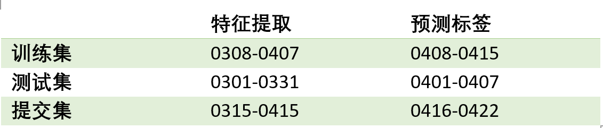

# 1. 数据处理 
## 1.1 填补空值
jdata_user.csv        
  
jdata_shop.csv     
  
处理：对日期列[shop_reg_tm]的空值填充2018-4-16 00:00:00，对其他列空值填充-1            
原因：京东提供数据对未知也用-1填充；xgboost可以通过指定空值数值，对其进行训练

## 1.2 处理无效数据[简单说]
### 1.2.1 user表：
1. 删除user表中没有任何行为的用户;
2. 转换user_reg_time为距离预测日期的年/月/日数，user_reg_day/month/year
### 1.2.2 product表：
1. 删除product表中没有被操作(浏览、下单、关注、评论、加购物车)过的品类；         
2. 转换market_time为距离预测日期的年/月/日数，product_day/month/year
### 1.2.3 shop表：
1. 删除shop表中没有品类的店铺；    
2. 将shop表中的cate类别列改名为shop_cate列；   
2. 转换shop_reg_time为距离预测日期的年/月/日数，shop_reg_day/month/year     
### 1.2.4 comment表：
1. 删除comment中对不存在的品类的评论；
### 1.2.5 action表:      
1. 删除action表中操作的品类和用户不存在的行为；         

处理无效数据结果：    
  


# 2. 数据分析[加分析每个原字段对购买是否有影响,加筛选过程]
## 2.1 用户购买数量
以日为单位，对购买行为进行计数，绘制折线图  
    
分析：
1. 2月购买行为异常(猜测可能是受春节影响)，因此去除2月的数据

## 2.2 用户品类(店铺)预测数量
以7天为单位，统计每七天中user_cate出现的数量，绘制折线图
    
注释：取均值，用于后面预测user_cate时根据概率排序进行筛选。

## 2.3 用户品类预测与历史行为关系
统计前几天行为在预测用户品类结果中所占比例，绘制折线图    
     
注释：用于构建用户品类模型训练集测试集和提交集的样本
结论：权衡复杂度和预测得分，30天具有最好的预测效果


## 2.4 用户品类店铺预测与历史行为关系
统计历史多少天行为可能影响预测用户品类店铺结果    

     
注释：用于构建用户品类店铺模型训练集测试集和提交集的样本     
结论：权衡复杂度和预测得分，30天具有最好的预测效果


# 3. 模型[ucs_0,us_0,ucs_1]

## 3.1 模型1：4.16-5.10
### 3.1.1 想法
### 3.1.2 样本分析与选取
### 3.1.3 特征设计与筛选
说筛选前特征数量，筛选掉的特征
### 3.1.4 模型训练测试
### 3.1.5 模型提交结果选取
### 3.1.6 问题与方案
## 3.2 模型2： 5.10-5.20
### 3.2.1 想法
### 3.2.2 样本分析与选取
### 3.2.3 特征设计与筛选  
## 3.3 模型3： 5.20-5.26
### 3.3.1 想法
uc+ucs，
即首先对用户品类进行预测；
基于用户购买品类对店铺进行预测，
然后对两类模型进行融合
### 3.3.2 样本分析与选取
### 3.3.3 特征设计与筛选


# 4. 改进[加样本筛选，cart]
## 4.1 模型融合
虽然xgboost是数据挖掘比赛的一项利器，但是还是有着美中不足的地方，例如在本次比赛中（结合本次比赛的具体内容拓展）
- 每轮迭代时，都需要遍历整个训练数据多次。如果把整个训练数据装进内存则会限制训练数据的大小；如果不装进内存，反复地读写训练数据又会消耗非常大的时间。
- 预排序方法（pre-sorted）：首先，空间消耗大。这样的算法需要保存数据的特征值，还保存了特征排序的结果（例如排序后的索引，为了后续快速的计算分割点），
这里需要消耗训练数据两倍的内存。其次时间上也有较大的开销，在遍历每一个分割点的时候，都需要进行分裂增益的计算，消耗的代价大。
- 对cache优化不友好。在预排序后，特征对梯度的访问是一种随机访问，并且不同的特征访问的顺序不一样，无法对cache进行优化。
同时，在每一层长树的时候，需要随机访问一个行索引到叶子索引的数组，并且不同特征访问的顺序也不一样，也会造成较大的cache miss。
- 带深度限制的Leaf-wise的叶子生长策略
- Leaf-wise的缺点：可能会长出比较深的决策树，产生过拟合。
采用stacking lightGBM可以有效的弥补xgboost的缺点

因此LightGBM在Leaf-wise之上增加了一个最大深度限制，在保证高效率的同时防止过拟合。

## 4.2 特征工程
经典全局特征重要性度量（除了特征值的增加，还应该在特征选取的方法上改进）
最直接的选择就是使用XGBoost Python接口中的plot_importance()方法。它能给出一个简单的柱状图来表示我们数据集中每一个特征的重要性。
但是身为优秀的“数据科学家”，我们从文档中得知在XGBoost中对特征重要性的度量共有三个选项：
- Weight：一个特征在所有决策树中被用来划分数据的次数。
- Cover：一个特征在所有决策树中被用来划分数据的次数和每次划分涉及的样本个数得到的加权结果。
- Gain：一个特征被用于划分数据时所带来的训练损失减益的平均值。
这些都是几乎在任何树模型的包里都能见到的典型重要性度量。Weight是默认选项，所以我们决定试一下另外两个选项，看结果是否有所差别。

如何判断特征重要性的度量是好是坏？    
比较不同特征归因方法（feature attribution method）的优劣并不容易。为了方便比较，我们定义如下两个指标：
- 一致性：如果我们对一个模型作出修改，使得它更依赖于某一个特征的话，那么由特征归因方法所得到的该特征的重要性（attributed importance）不应当降低。
- 准确性：所有特征重要性的和应等于模型的总重要性。例如，如果重要性是由R²值计算得到的，那么各个特征的R²值相加应等于模型的R²值。

如果某种特征归因方法不满足一致性，我们就很难用这种方法来比较两个模型。因为即便我们算得一个特征在一个模型的重要性更高，也不意味着这个模型更依赖于该特征。
而当一个方法不满足准确性时，我们不知道每个特征的重要性跟模型重要性间的关系是怎么样的。所以我们就不能对归因方法的结果直接归一化，因为归一化可能会打破一致性。


## 5 展示
### 5.1 问题
1. 异常检测与处理
- 样本筛选不足：去除不会购买的用户品类店铺
    - 只购买过1次没有别的行为[删除]
    - 没粉丝/购买店铺
    - 注释：购买周期一般是30，应该用前30天行为作为可能发生购买的样本基础，但需要进行进一步筛选，以减少行数
- 特征提取不足
    - 购物车行为[特殊处理]
2. 提交结果筛选
- 鲁棒性差：测试集分高不代表提交集高
3. 筛选后特征依旧偏多
- 品类特征筛选前300，筛选后102
- 店铺特征筛选前504，筛选后160
### 5.2 通过其他组比对反思
1. 正负样本采用过采样/欠采样
2. 反复根据模型特征重要性排序删除特征
3. 说全探索过程: ucs_0, us_0, ucs_1，程日小组三个人三个模型老师认为比较用心
4. 没分析原数据每个字段!!!，是否元数据列都有效


```展示备份
### 问题1：    
由于数据集较大，如果所有特征均从原数据表中直接进行运算提取然后融合，在64G内存的服务器上依据会造成内存溢出问题
### 解决方案1：      
1. 按照设计的特征划分action数据，保存其子数据集，从而加快读写速度。
2. 事先生成所需全部特征的缓存(即保存为csv格式)，构建数据集时直接从缓存加载。    
### 问题2：     
由于正负样本不均衡问题，如果采用二分类类别为目标函数，即预测结果由0,1构成，可能会导致预测结果过少      
### 解决方案2：    
1. 通过调节scale_pos_weight参数以增加正样本的权重。    
2. 采用二分类概率为目标函数，即预测结果为1的概率，从而可以得到所有样本的预测结果，避免预测结果不足的问题     
3. 复现京东计分函数来进行预测结果的筛选。根据数据分析中对user_cate的数量分析，选取平均值18万上下10万中最优的得分行数作为提交的预测行数。 

### 3.5.1 预测用户品类
1. 划分训练集，测试集如下：     
   
2. 根据预测与历史行为关系分析，选取历史30天的行为构建可能发生购买的样本集，      
3. 设计并融合如下特征
用户特征：    
-  用户年龄特征
-  用户性别
-  用户等级特征
-  用户地点特征(城市等级/城市/县/省)
-  注册时间与截止日期的时间间隔（年/月/日）
-  用户的重复购买率 
-  用户前 1/2/3/7/14/30 天 5 种行为 0/1 提取
-  用户前 1/2/3/7/14/30 天5种行为次数
-  用户各行为/总行为的比值
-  用户购买行为的转化率（行为2/行为1 、行为2/行为3 、行为2/行为4、行为2/行为5）
-  用户前 1/2/3/7/14/30 天5种行为天数
-  用户最近一次行为的时间距离当前日期的时间(小时)
-  用户最远一次行为的时间距离当前日期的时间(小时)
-  用户最近一次行为的行为次数

品类特征
-  品类类别特征独立编码
-  品类的重复购买率 
-  品类前 1/2/3/7/14/30 天 5 种行为 0/1 提取
-  品类前 1/2/3/7/14/30 天5种行为次数
-  品类各行为/总行为的比值
-  品类购买行为的转化率（行为2/行为1 、行为2/行为3 、行为2/行为4、行为2/行为5）
-  品类前 1/2/3/7/14/30 天5种行为天数
-  品类最近一次行为的时间距离当前日期的时间(小时)
-  品类最远一次行为的时间距离当前日期的时间(小时)
-  品类最近一次行为的行为次数

用户品类特征
-  用户品类的重复购买率
-  用户品类前 1/2/3/7/14/30 天5种行为 0/1 提取
-  用户品类前 1/2/3/7/14/30 天5种行为次数
-  用户品类各行为/总行为的比值
-  用户品类购买行为的转化率（行为2/行为1 、行为2/行为3 、行为2/行为4、行为2/行为5）
-  用户品类前 1/2/3/7/14/30 天5种行为天数
-  用户品类最近一次行为的时间距离当前日期的时间(小时)
-  用户品类最远一次行为的时间距离当前日期的时间(小时)
-  用户品类最近一次行为的行为次数
-  用户关注或加购该品类，但是不购买，且加购或关注天数距离最后日期小于 10 天的记为 1，否则记为 0 

4. 用value_counts()去除只有1个值的无效特征。示例如下：    
   
5. 由于gridsearchcv对于大数据集速度极慢，所以采用坐标下降的方法，按照影响程度从大到小进行每个参数的网格搜索，示例过程如下，    
最后得到的最优参数如下，  
   
6. 设置最优模型参数并训练，通过模型测试集auc得分和京东计分函数估计模型的得分，根据得到的模型特征重要性和人工判断删除无效特征，重复5-6，直至模型得分不再提升
7. 用训练好的模型对测试集样本进行预测得到购买概率，通过京东计分函数得到得分最高的行数160000。    
7. 对提交集进行预测并选取概率最高的160000行，作为店铺预测的输入。   


### 3.5.2 预测用户品类下店铺
1. 划分训练集，测试集与品类相似
2. 选取历史30天的行为构建可能发生购买的样本集。    
3. 设计并融合如下特征
店铺特征
•	粉丝数
•	会员数
•	主营类目
•	店铺评分
•	店铺评论/好评/差评总量
-  店铺的重复购买率 
-  店铺前 1/2/3/7/14 天 5 种行为 0/1 提取
-  店铺前 1/2/3/7/14 天5种行为次数
-  店铺各行为/总行为的比值
-  店铺购买行为的转化率（行为2/行为1 、行为2/行为3 、行为2/行为4、行为2/行为5）
-  店铺前 1/2/3/7/14 天5种行为天数
-  店铺最近一次行为的时间距离当前日期的时间(小时)
-  店铺最远一次行为的时间距离当前日期的时间(小时)
-  店铺最近一次行为的行为次数

用户店铺特征
-  用户店铺的重复购买率
-  用户店铺前 1/2/3/7/14 天5种行为 0/1 提取
-  用户店铺前 1/2/3/7/14 天5种行为次数
-  用户店铺各行为/总行为的比值
-  用户店铺购买行为的转化率（行为2/行为1 、行为2/行为3 、行为2/行为4、行为2/行为5）
-  用户店铺前 1/2/3/7/14 天5种行为天数
-  用户店铺最近一次行为的时间距离当前日期的时间(小时)
-  用户店铺最远一次行为的时间距离当前日期的时间(小时)
-  用户店铺最近一次行为的行为次数
-  用户关注或加购该店铺，但是不购买，且加购或关注天数距离最后日期小于 10 天的记为 1，否则记为 0 

 品类店铺特征
-  品类店铺的重复购买率
-  品类店铺前 1/2/3/7/14 天5种行为 0/1 提取
-  品类店铺前 1/2/3/7/14 天5种行为次数
-  品类店铺各行为/品类总行为的比值
-  品类店铺购买行为的转化率（行为2/行为1 、行为2/行为3 、行为2/行为4、行为2/行为5）
-  品类店铺前 1/2/3/7/14 天5种行为天数
-  品类店铺最近一次行为的时间距离当前日期的时间(小时)
-  品类店铺最远一次行为的时间距离当前日期的时间(小时)
-  品类店铺最近一次行为的行为次数

 用户品类店铺特征
-  用户品类店铺的重复购买率
-  用户品类店铺前 1/2/3/7/14 天5种行为 0/1 提取
-  用户品类店铺前 1/2/3/7/14 天5种行为次数
-  用户品类店铺各行为/总行为的比值
-  用户品类店铺购买行为的转化率（行为2/行为1 、行为2/行为3 、行为2/行为4、行为2/行为5）
-  用户品类店铺前 1/2/3/7/14 天5种行为天数
-  用户品类店铺最近一次行为的时间距离当前日期的时间(小时)
-  用户品类店铺最远一次行为的时间距离当前日期的时间(小时)
-  用户品类店铺最近一次行为的行为次数
-  用户品类关注或加购该店铺，但是不购买，且加购或关注天数距离最后日期小于 10 天的记为 1，否则记为 0 

4. 用value_counts()去除只有1个值的无效特征。  
5. 进行每个参数的网格搜索，最后得到的最优参数。    
6. 设置最优模型参数并训练，通过模型测试集auc得分和京东计分函数估计模型的得分，根据得到的模型特征重要性和人工判断删除无效特征，重复5-6，直至模型得分不再提升，
6. 以用户品类的预测结果作为输入，预测结果按照用户在不同品类下对所有店铺购买的概率值排名，取每个用户品类所有店铺的最高概率值作为店铺的预测，完成提交结果。


```